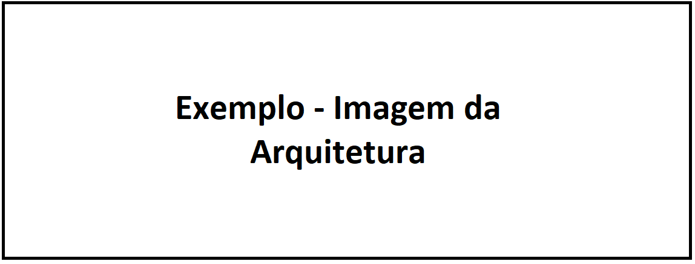

## Terraform
### Pré-requisitos:
- **Login no TF Cloud:** Você precisará autenticar seu terminal do terraform com as credenciais do seu time (ex. deploy, ops), tendo a senha do usuário do seu time em mãos basta seguir os passos abaixo:
  
   - Clique em: https://app.terraform.io/app/settings/tokens?source=terraform-login e faça login com as credenciais do seu time (ex deploy, ops...)
    - Abra o terminal da sua máquina e digite `terraform login` 
    - Aprovar que deseja prosseguir digitando `yes`, o seu navegador irá abrir a página de tokens do Terraform Cloud.
    - Em `description` digite `terraform <seu nome>`, para que o token seja criado com seu nome e clique em `Create API token`.
    - **Copie o token que será exibido na tela** (ele não será exibido novamente) e cole-o no seu terminal, quando solicitado `Token for app.terraform.io`**
  

----

## Pontos de Atenção:
- **Branch Main:** A branch main é a branch de produção, para atualizá-la é necessário abrir um Pull Request para a branch main e aprovar o PR.

----

## Arquitetura

